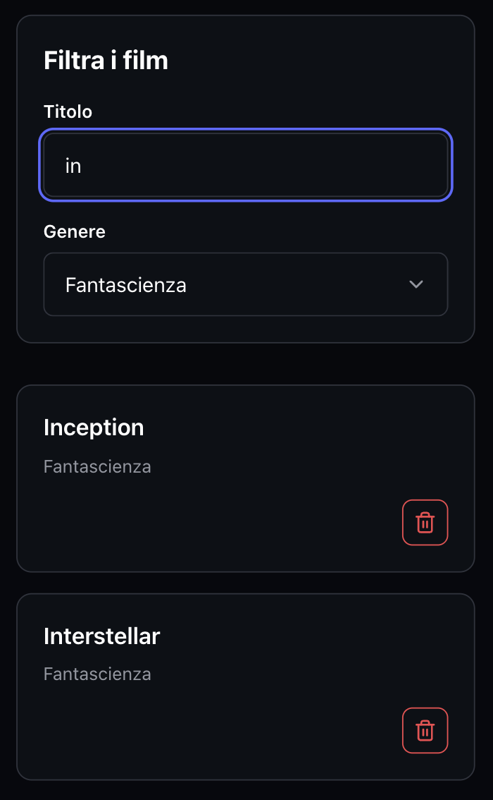

# React Movie Filter

Esercizio React su useEffect e filtri dinamici.



## Esercizio

Partendo dalla lista iniziale disponibile in [`src/data/movies.js`](./src/data/movies.js):

- mostrare tutti i film presenti nella lista;
- aggiungere una select per filtrare dinamicamente i film per genere;
- mostrare tutti i film quando non è selezionato alcun genere;
- utilizzare lo stato e `useEffect` per aggiornare la lista filtrata.

### Bonus

- aggiungere un campo di ricerca per filtrare i film anche per titolo;
- creare un form per aggiungere nuovi film alla lista.

## Soluzione

Lo stato principale, i filtri e gli handler dei film sono gestiti in [`src/App.jsx`](./src/App.jsx). [`MovieFilter`](./src/components/MovieFilter.jsx) contiene i controlli per la ricerca per titolo e genere, mentre [`MovieForm`](./src/components/MovieForm.jsx) gestisce l'aggiunta di nuovi film. [`MovieList`](./src/components/MovieList.jsx) e [`Movie`](./src/components/Movie.jsx) renderizzano la griglia responsive e i singoli film, che possono anche essere eliminati.

I controlli riutilizzabili dell'interfaccia, come pulsanti, input, select e card, si trovano nella cartella [`src/components/ui`](./src/components/ui).

## Avvio in locale

- Clona il repository:

  ```bash
  git clone https://github.com/emanuelefavero/react-movie-filter.git
  ```

- Entra nella cartella del progetto e installa le dipendenze:

  ```bash
  cd react-movie-filter
  npm install
  ```

- Avvia il server di sviluppo:

  ```bash
  npm run dev
  ```

- Apri `http://localhost:5173` nel browser per vedere l'applicazione.
